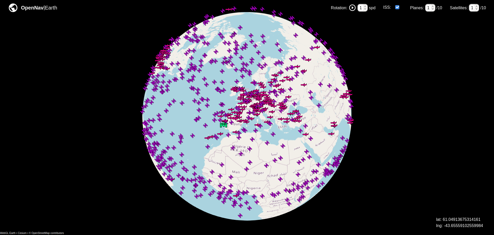

# OpenNav|Earth

__OpenNav|Earth__ is an open source website that allows to observe live aero spatial traffic. It also allows to get information about objects in flight.

You can use it here: [https://matisse-babonneau.fr/globe.html](https://matisse-babonneau.fr/globe.html)

